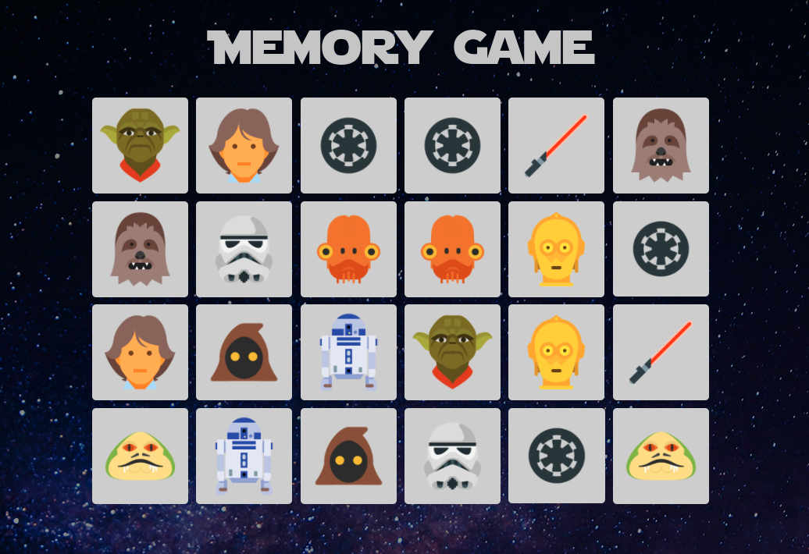

# memory-card-game
Learning Challenge

It was much more difficult than I expected, and checked lots of reference.
Still need to understand the structure more, but finally I made this.

## Points needed more knowledge
- Card reset
- Card shuffle

May the force be with me...

https://mari-mizutani.github.io/memory-card-game/

